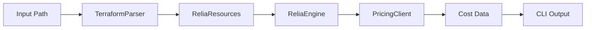

# Relia Architecture

Relia follows a linear pipeline architecture designed for speed and determinism.

## 1. The Parser (`relia.core.parser`)
*   **Responsibility**: Converts Infrastructure-as-Code into standardized `ReliaResource` objects.
*   **HCL Support**: Uses `python-hcl2` to parse static `.tf` files.
*   **JSON Support**: Reads `terraform show -json` output for 100% accurate plan data.
*   **Output**: List of `ReliaResource(type, name, attributes)`.

## 2. The Matcher (`relia.core.matcher`)
*   **Responsibility**: Maps Terraform attributes to AWS Pricing API filters.
*   **Logic**:
    *   `aws_instance` -> `ServiceCode: AmazonEC2`
    *   `instance_type: t3.large` -> `instanceType: t3.large`
    *   `region: us-east-1` -> `location: US East (N. Virginia)`

## 3. The Pricing Client (`relia.core.pricing`)
*   **Responsibility**: Fetches monthly costs in USD.
*   **Layer 1 (Bundled DB)**: `bundled_pricing.db` (SQLite) ships with the package for instant lookup of common resources.
*   **Layer 2 (Local Cache)**: `pricing_cache.db` stores API results for 7 days.
*   **Layer 3 (AWS API)**: Hits `boto3` pricing client as a fallback.

## 4. The Engine (`relia.core.engine`)
*   **Responsibility**: Orchestrates the flow.
*   **Policy Check**: Loads `.relia.yaml` and verifies:
    1.  Total Budget Cap.
    2.  Per-resource cost limits.

## 5. The CLI (`relia.cli`)
*   **Built with**: `Typer` (commands) and `Rich` (tables, trees).
*   **Commands**:
    *   `estimate`: Shows cost table, topology tree, and diffs.
    *   `check`: Enforces budget for CI/CD.
